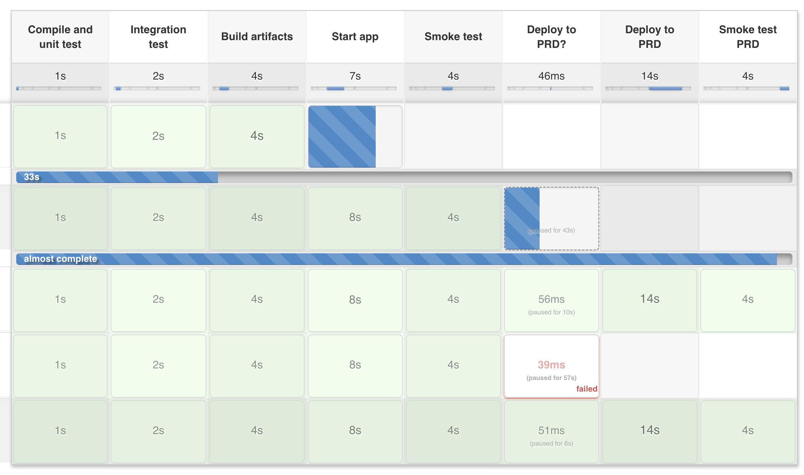
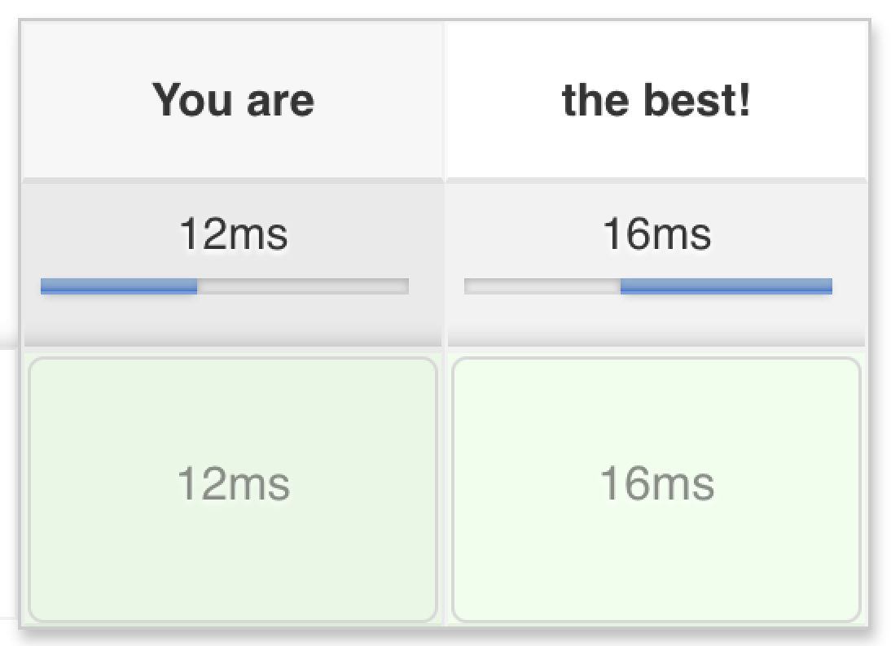
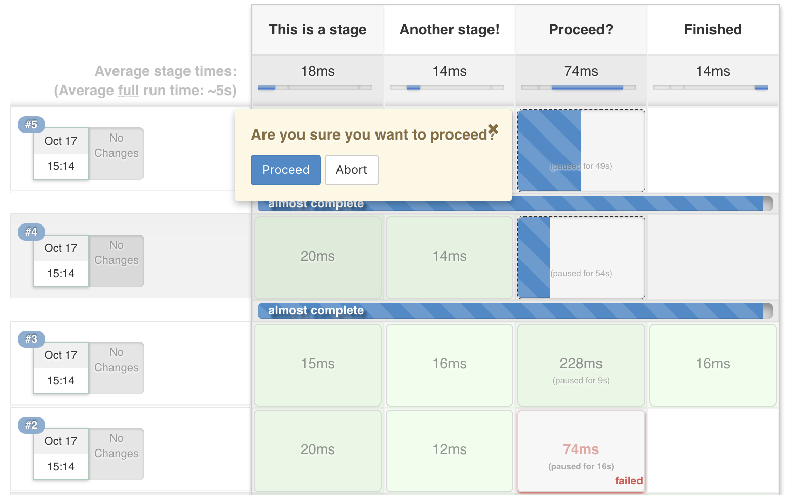
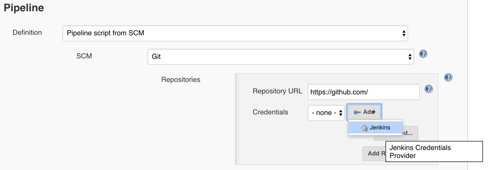
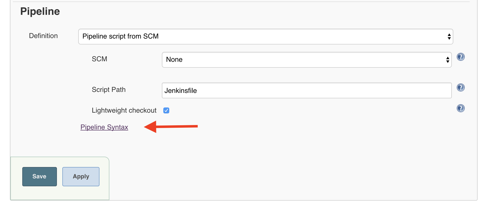
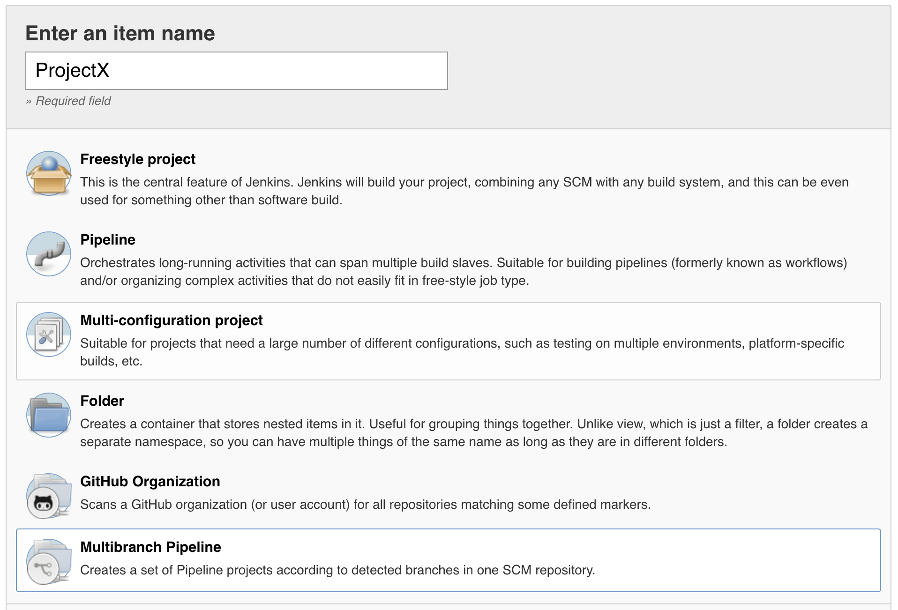
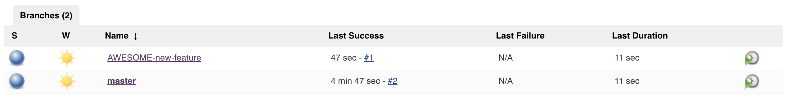

# Chapter 4 - Jenkins Pipeline

## Introduction

https://jenkins.io/solutions/pipeline/ (since jenkins 2.0)

The jenkins pipeline feature helps you visualise your workflow which typically starts with a commit and ends with a deployment to a specific environment.

  

A pipeline is created by writing Groovy code using a specific Pipeline DSL. There are two ways to describe your pipeline, either declarative or scripted.

The short version of describing the difference between the two is that the declarative syntax guides you more while the scripted is less restrictive.
During the rest of this course we will be using the scripted syntax as we want to use its flexibility.

More info: https://jenkins.io/doc/book/pipeline/syntax/#compare
 

### Lab 4.1 First pipeline

Do the following:

- Go to your jenkins homepage
- Create a new Pipeline Job, give it a name
- Write code for a **scripted pipeline** (not a declarative one), so that the pipeline looks like the one shown below 
    - Just use the script panel in the Jenkins UI for now to define your pipeline
- Trigger the job manually

  

## Basic pipeline features

To explain some basic features of jenkins pipeline we will refer to a blog post written by a CloudBees employee:
https://jenkins.io/blog/2016/10/16/stage-lock-milestone/

One of the earlier issues with pipeline scripts is described in the following situation:

Imagine a simple pipeline: `build-app -> proceed? -> deploy-app`  
The `proceed?` stage is configured to wait for user input (a simple click on a button) before proceeding to the deploy-app stage.

You decide that after 3 successful checkins, it is time to deploy your app. 
'Proceed' is selected on the top row and the app is deployed successfully.
Result: The top lane is green all the way and the others... well, they keep blinking on the second step because they are still waiting on user input.
This is not always a desirable scenario.

### Lab 4.2 Pipeline basics

We can fix the above described scenario using some pipeline features you just read about.

Do the following:

- Create a pipeline that contains an input step somewhere in between
- Make sure that if one run passes the input step, previous runs are cancelled automatically

The result should look something like this:

  

## Source control

One of the key principles of devops is that everything that is worth automating, should be automated and added to source control.

Writing code in a UI is not very persistent. If we lose our jenkins server, we have to start from scratch. 
So the next step is to make use of the 'Pipeline script from SCM' feature.

Before jenkins can access our Jenkinsfile we have to configure a few things.
Jenkins will need access to your personal repository. 
You could enter your personal github credentials but we prefer to create a Github account specifically for Jenkins which we give access to our repositories.

We have created an account that everyone can use for the purpose of this exercise. Ask a teacher for the account information.

### Lab 4.3 Source control pipeline

Do the following:

1. Create a new repository on Github. 
1. Copy the IntelliJ Java project from the labs in Chapter 3: Gradle to the repository. Commit and push.
1. Put your previously created pipeline in a file called `Jenkinsfile` in the root of this repository. 
1. Configure the `< github-jenkins-account-name >` as collaborator of your repository (via the Github web UI)
1. Create a new jenkins pipeline job
1. In the pipeline definition select `Pipeline script from SCM`
   - Add your Github repository login
   - Select to add new credentials
   - If there are credentials available already, ignore those for now 
     - Fill in `< github-jenkins-account-name >` and `< github-jenkins-account-password >`
1. Configure the job to build after every commit
1. Do a commit and ~~watch the world burn~~ enjoy the scenery

> NOTE: For the teachers => don't forget to accept the collaboration requests.

How to configure jenkins to use a technical user to access your repository:

  

  

## Executing gradle in a pipeline

The next step is to run our gradle build in the jenkins pipeline. How do we get to there?

First you have to realise that up until now we only checked out the repository to interpret the Jenkinsfile.
To be able to use all of our code in the job execution, we have to specify a checkout in the Jenkinsfile itself as this is the starting point of our actual pipeline.

Executing gradle in the checked out workspace is easy, can you guess why?

  

That's right, thanks kid!

The gradle wrapper is just sitting there, waiting to be used and so you should!

### Lab 4.4 Run a build in a pipeline

Do the following:
- Create a pipeline containing 2 stages: a `Compile` stage and a `Test` stage
- The `Compile` stage checks out the code and compiles it
- The `Test` stage runs the tests and archives the test results to make them viewable in jenkins 

> Jenkins has a page where example pipeline steps can be generated in groovy code.
This can be used in your quest to find a solution. 

  

## Multibranch pipeline

Jenkins also offers the possibility to configure a multibranch pipeline.

  

While the normal pipeline job can build multiple branches, a multibranch pipeline adds some extra functionality like grouping builds per branch.
It will build branches that matches the provided configuration. (e.g. any branch with the prefix 'HOTFIX-')

### Lab 4.5 Make jenkins pick up your branch

Do the following:
- Create a multibranch pipeline
- Configure your pipeline to run your master branch and any branch which has the prefix 'AWESOME-'.
- Test your configuration by creating the following three branches:
    - AWESOME-course 
    - AWESOME-teachers
    - random-test

You don't want every branch to be picked up by jenkins so when you create the branch named `random-test`, jenkins should ignore it. 

> Don't forget to push the branches to your repo, maybe even do a few code changes. 
Otherwise, what's the use of your branch? ;)

Here is an example of what a multibranch pipeline looks like when it has multiple branches:

  

## Miscellaneous

There are of course many more features jenkins has to offer regarding pipeline or continuous delivery in general.
Handling all them is beyond the scope of this training.

One of them we still want to mention is the Docker Plugin.
This plugin lets jenkins spin up docker containers to use as slaves to run builds.
It will spin up more containers depending how many builds are waiting to be executed and the configured amount of containers it is allowed to spin up.
This can help towards resource usage optimisations.

## Lab 4.6 Your app needs a pipeline!

By now you should have enough tools in your toolbox to setup a pipeline for your app.
So get to it!

Do the following:

- In lab 4.3 we added credentials via username and password, here we will create one using an ssh key.
    - Kind: `SSH Username with private key`
    - Username: `jenkins`
    - Private key: `From the Jenkins master ~/.ssh`
    - Click the Add button
    - Select the credential in the Credentials dropdown
- Create a pipeline containing 3 stages: a `Compile` stage, a `Unit test` stage and an `Integration test` stage
- The `Compile` stage checks out the code and compiles it
- The `Unit test` stage runs the unit tests and archives the test results to make them viewable in jenkins
- The `Integration test` stage runs the integration tests and archives the test results to make them viewable in jenkins

  

